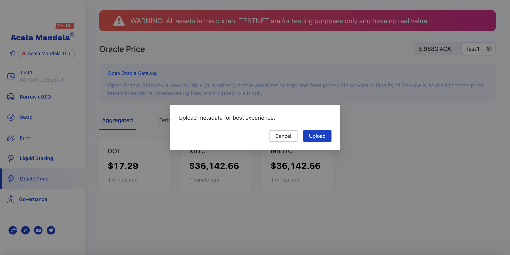

# 试一试Acala Dapp

.png>)

在ETHDenver live testnet上试用Acala的DeFi组件

* 设置Polkadot{js} 扩展程序 (Metamask for Polkadot), 并创建账户[这里](https://wiki.polkadot.network/docs/en/learn-account-generation#polkadotjs-browser-plugin)
* 使用[入门指南](../gao-ji/shi-yong-lian-shang-tiao-du-qi/zhi-nan.md) 来指导使用应用. 请注意ETHDenver DApp 和节点是不一样的，区别在下文中阐释。
* [Dapp](https://acala-dapp-git-update-acalanetwork.vercel.app): 该部署连接到用于ETHDenver黑客马拉松的同一网络（TC6）。
* [ETHDenver Nodes](https://wiki.acala.network/learn/get-started/public-nodes#latest-ethdenver-nodes)

当第一次登陆DApp网站时，你会被要求上传元数据，点击`upload`并在Polkadot{js}扩展提示中签署交易。该扩展还没有EVM部署的最新变化--来的太早啦!

