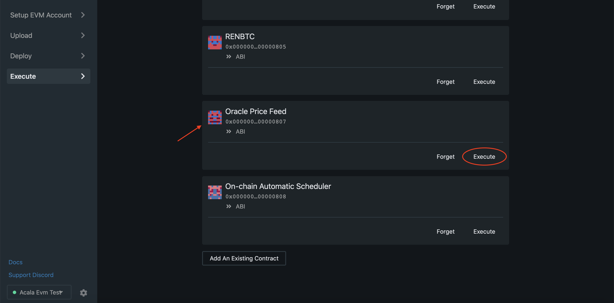

# 使用预言机喂价

Acala开放式预言机网关允许在Acala网络上部署多个预言机，利用Acala Defi优化的预言机基础设施，并为Acala, Polkadot, Kusama及其他网络的任何Dapp提供服务。开放式预言机网关确保了服务质量，即预言机交易并归类为系统交易，并保证一定可以放入区块中。

这个预编译的合约使得在Acala EVM内部可以查询各种资产的各种喂价。目前，`getPrice`方法返回一个给定资产的综合价格。更多的喂价选择将会在未来呈现。

合约的源代码在这里：[evm-examples/oracle](https://github.com/AcalaNetwork/evm-examples/tree/master/oracle).

> _**请注意:**_ 如果你在用EVM游乐场运行Acala的本地节点，你有可能会遇到所有token被标记为价格为0.

合约地址

预言机合约地址: `0x0000000000000000000000000000000000000807`

## 合约方法

```javascript
// Get the price of the currency_id.
// Returns the (price, timestamp)
function getPrice(address token) public view returns (uint256, uint256);
```

## 在游乐场上尝试

前往 [EVM 游乐场](https://evm.acala.network/#/execute) - `Execute tab`.

找到 `Oracle Price Feed` 合约然后点击 `Execute` 按钮。



在 `token: address` 域内,输入 ERC20 合约地址 (在例子中，DOT的地址是 `0x0000000000000000000000000000000000000802`) 感兴趣的tone. 推送服务当前对 DOT, RenBTC and XBTC开放.

在[这里](shi-yong-yuan-sheng-kua-lian-token.md)找到所有可用token的合约。

.png>)

点击 `Call` 按钮, `Call results` 将会显示价格和时间戳.

.png>)
