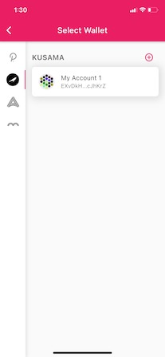

# 创建一个新的KSM地址

有几个钱包已支持Kusama，**但我们发现Polkadot.{js}浏览器扩展是最适合大多数桌面用户，Polkawallet移动应用程序是最适合大多数移动用户的。**根据你的钱包偏好，遵循以下指南**。**

## 步骤 1: 通过Polkadot{.js} 浏览器扩展程序创建钱包 

1\) 在浏览器地址栏中输入polkadot.js.org/extension

.png>)

2）针对不同的浏览器选择相应的 `download` 然后按照弹窗指示操作。Brave用户应当点击 `Download for Chrome`.

当Chrome和Brave用户点击浏览器右上角的扩展按钮（拼图），出现带 "P "的橙色圆圈时，他们就会知道下载是否成功。Chrome用户可以通过点击钉子图标将扩展程序钉在他们的工具栏上（见截图）。火狐浏览器用户将知道下载是否成功，因为带 "P "的橙色圆圈将出现在他们浏览器的右上角。

.png>)

3）点击你浏览器里的"P" 图标. 一个表示欢迎的对话框会出现。然后点击 `Understood, let me continue`.

4\) 点击圆圈中间的 `+` 号来添加账户

.jpeg>)

5\) 这时会出现一个画框，里面有你的地址和种子助记词。记录下种子助记词并把它存放在安全的地方。不要与任何人分享它。如果你忘记了你的密码或者你想导入你的账户，你的种子短语可以用来恢复你的账户。 点击`我已经安全地保存了我的种子助记词`，然后进入下一个步骤。

.png>)

6\) 下一个提示将允许你选择一个网络，命名你的帐户，并为帐户创建一个密码。因为你是在创建一个Kusama账户，所以从下拉框中选择Kusama Relay Chain。同时确保你使用一个强密码（至少6个字符）。&#x20;

点击 "用生成的种子添加账户 "按钮，创建你的账户。

.png>)

7\) 你的Polkadot.{js} 浏览器扩展程序现在已经准备就绪！这时你可以在浏览器扩展程序中看到你自己的账户。

.png>)

## 步骤 2: 通过Polkadot UI来管理你的账户 

1\) 现在可以讲浏览器扩展程序与 Polkadot-JS UI (用户界面) 连接起来管理你的账户。

在搜索栏输入"polkadot.js.org/apps"&#x20;

2\) 一个对话框将出现，请求对该网站的授权。点击按钮 `Yes, allow this application access`.

3\) 如果想要切换网络，请看向导航栏的左侧（本例中为粉红色），选择网络标志（本例中为Polkadot标志）附近的下拉菜单。点击Kusama，选择Parity托管的选项。点击粉红色的切换按钮。

4\)你应该看到你在Polkadot.{js}扩展程序中建立的账户已经被列账户列表中。你可以使用Polkadot UI来发送KSM、质押以及参与治理。如果你对这些领域感兴趣，请查阅我们关于这些主题的其他指南。&#x20;

## 通过Polkawallet创建钱包 

1\) 通过[Apple App Store](https://apps.apple.com/us/app/polkawallet/id1520301768) 下载Polkawallet钱包，或通过[Google Play](https://play.google.com/store/apps/details?id=io.polkawallet.www.polka\_wallet)为安卓设备下载。

2\) 点击 `Create Account.`

3\) 一个新的页面出现，它将强调把你的种子助记词记录在一个安全的地方的重要性。点击 `Next`.​

4\) 你的种子助记词在展示在这里，把它们记在之上或者存在安全的地方。点击 `Next`.​

5\) 按照正确的顺序输入种子助记词来确认你已经记住你的助记词。完成后点击 `Next` 。

6\) 给你的账户命名以及为它创建一个高强度的密码（至少6个字符）。完成后点击下一步。

​7) 现在你的钱包已经设置好了。你可以看到你的Polkadot地址了，就是以1开头的地址。如想看到整个Polkadot地址或者复制该地址，可以点击右上角的三道杠。

8\) 在左手边栏上会显示一系列网络logo，你可选择你希望连接的网络。选择Kusama的logo（圆圈里有个鸟）然后点击有账户名字的展示框。

9\) 页面将会重新载入，然后你就连入Kusama网络了。

.jpeg>)
