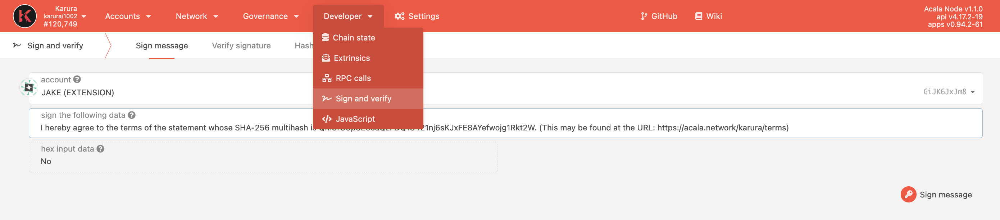

# 领取KAR

**🔔 领取服务已经上线，请尽快领取你的KAR奖励。**如果你通过非官方支持的途径来支持众贷，你需要阅读和同意相关条款来领取你的token。你可以在[这里](https://distribution.acala.network)查询你是否需要领取token。

## 使用Polkadot{js} 浏览器扩展程序

前往 [claims website](https://distribution.acala.network/claim/acala). 连接到你的 Polkadot{js} 扩展程序, **使用你参加众贷的账户**, 然后按照弹窗指示来完成流程。

你需要使用扩展程序来对信息签名，该操作并不需要交易费。一旦完成，最多48小时就可以安排分发了。

## 手动领取

前往奖励领取网站.如果你没有通过Polkadot{js}扩展程序参与众贷，你可以选择  `Claim Manually` 并输入你参与Karura众贷的地址。

.png>)

有两种方法领取奖励：

A) 在Kusama上发送一个带有特定信息的系统备注，或者

B) 使用**签名和验证**来签署特定的信息 以下是如何使用这两种领取方法的指南。

### A) 使用签名和验证

你可以前往 [Polkadot App - Developer - Sign and Verify](https://polkadot.js.org/apps/#/signing) (Polkadot, Kusama, 或 Acala 都可以). 签名和验证仅仅只是对信息签名，并不需要手续费。

1\) 必须使用用于Karura众贷的账户



2\) 在签署以下数据栏时，请粘贴和复制如下指令来签名（在领取网页显示）

```
I hereby agree to the terms of the statement whose SHA-256 multihash is QmSfG9pSE3eaQzFDQ1S421nj6sKJxFE8AYefwojg1Rkt2W. (This may be found at the URL: https://acala.network/karura/terms)
```

3\) 签名，复制哈希然后粘贴回领取网页，即完成流程。

.png>)

一旦完成手续，最多48小时就会安排分发时间。

### B) 使用系统标记

如果你不能使用**签署和验证**来签署消息，比如你使用了一个代理账户来参与或者你用来参与众贷的机构（比如钱包）没有**签名和验证**设施，那么你可以在Kusama上发送一个系统备注来领取KAR。

1\) 登录 [Polkadot.js Apps - Kusama](https://polkadot.js.org/apps/#/explorer), 你必须连接到Kusama网络中。

.png>)

2\) 前往Developer-Extrinsics 部分.

.png>)

3\) **你必须选择与Karura众贷相同账户**。

在提交以下extrinsic内容，选择系统，然后在下拉菜单中选择 remarkWithEvent(\_remark)。

.png>)

4\) In the \_remark: Bytes域中, 输入签名所需的消息。复制和粘贴所需的签名信息。（在领取网站上显示）。

`I hereby agree to the terms of the statement whose SHA-256 multihash is QmeUtSuuMBAKzcfLJB2SnMfQoeifYagyWrrNhucRX1vjA8. (也可在如下链接中找到:` [`https://acala.network/acala/terms`](https://acala.network/acala/terms)`)`

5）点击 `Submit Transaction`.&#x20;

.png>)

6\) 请输入你的密码然后签署交易。请注意你需要支付一定费用来开启交易，所以请确保你的账户里有一定费用。

.png>)

7\) 你的标记交易已经递交给Kusama。你可以在[Kusama subscan 浏览器](https://kusama.subscan.io)中看到签署的标记信息。在这里粘贴你的Kusama地址来发送交易

.png>)

8\) 你可以看到 `system(remark_with_event)` 已在你的交易历史中。 点击相应的`Extrinsic ID`

.png>)

9\) 复制 `Extrinsic Hash`

.png>)

10）将 Extrinsic hash 粘贴到领取网站完成手续。

一旦手续完成，最多48小时就可以安排分发了。
